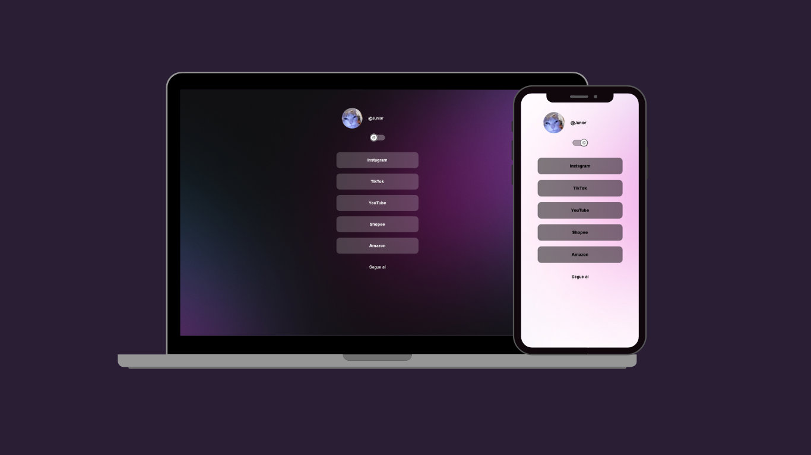

# Anexador de Links Responsivo  

  

Este é um projeto de um site responsivo para anexar links, com um design moderno e funcionalidade para alternar entre temas de cores. Ideal para personalizar e centralizar todos os seus links em uma única página estilizada.  

## 🛠️ Tecnologias Utilizadas  
- **HTML5**: Estrutura da página.  
- **CSS3**: Estilização com variáveis e keyframes.  
- **JavaScript**: Funcionalidade de alternância de cores.  

## ✨ Funcionalidades  
- **Totalmente responsivo**: Adapta-se a diferentes dispositivos.  
- **Alternância de tema**: Mude facilmente entre cores claras e escuras.  
- **Estilo moderno**: Design limpo e minimalista.  

## 📂 Como Visualizar o Projeto  
Você pode experimentar o projeto diretamente clicando no link abaixo:  

🔗 [Acessar o Anexador de Links](https://vitor-dbelo.github.io/-Junior-Anexador-de-link/)  
